# PGC-Crime-Collector

# About

PGC Crime Collector is a web-based application that is designed to solve the lack in accessible information the Prince George's County general public has on their communities. With the website, users are able to navigate accurate and organized PG County crimes via the search and data functionality.

This web-based application is split up in two sections Home, About, and Data

# Home Page

Users can search for specific crime entries and see information about each crime including the Case ID, Date, Crime Type, and Street Address. They can filter through the data by using the drop down filter list to select the specific crime type they wish to see in the results. The crime type includes Accident, Theft, Robbery, Sex Offence, and Assault.

# About Page

Users can explore data on the Crime Incidents February 2017 to Present dataset to see a more personal representation of Prince George's County crime from residents and incoming residents. They can engage with the data visual by hovering and inputing a crime type.                   

# Data Page

# Documentation

This web-based application was created using HTML, CSS, JavaScript, APIs, JSON file, Leaflet, SQLite, Express, and Node.Js.
    
I used HTML and CSS for the overall design of the frontend portion of the web application. 

JavaScript for the user interactions with the web application.
                                
Express/Node.Js and SQLite was used for the backend part of the website, essentially storing the data from the PG County API.
                  
SQLite was used to filter out five different types of crimes of accidents, theft, sex offense, robbery, and assualt for the Home page

SQLite was also used to allow users to add crimes they did not see in our website and have our database create a table based on that adding if found in the PG County API

PUT requests can be submitted to the API and is used to send data to our server to update our database 
                       
GET requests can be retrieved from the API and it retrieves a list of JSON objects containing Prince Georges County crimes information from the database
                           
GET requests can also return a confirmation string or an error message once completed
                           
POST is used to add data to the database, which is in the Data Page                           

# Result when the user opens up the web based application
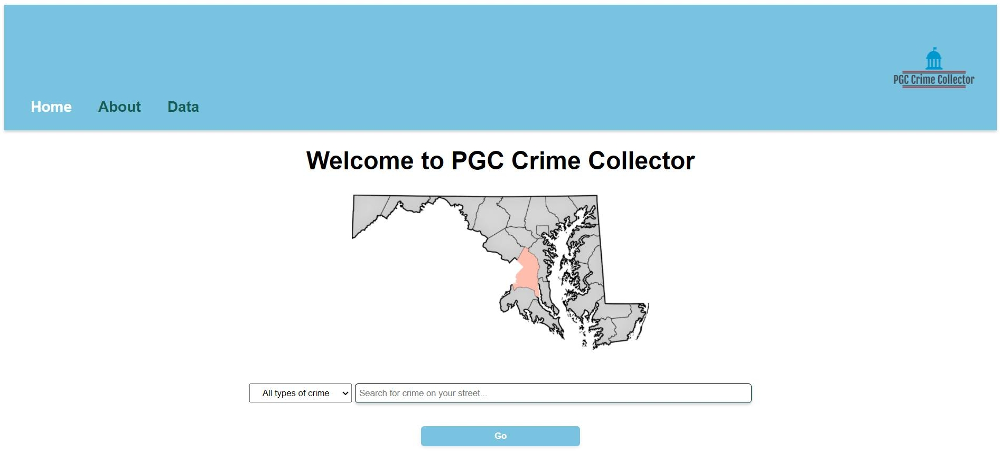
# Result when the user clicks on All Types of Crimes
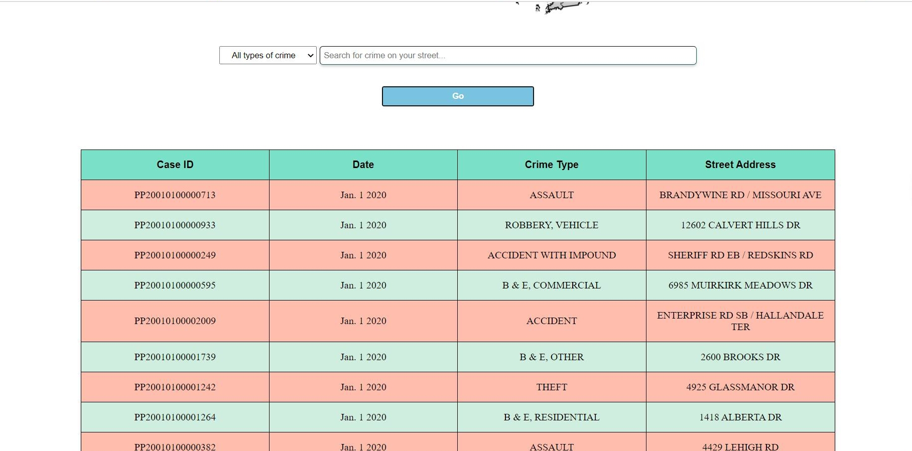
# Result when the user clicks on accident
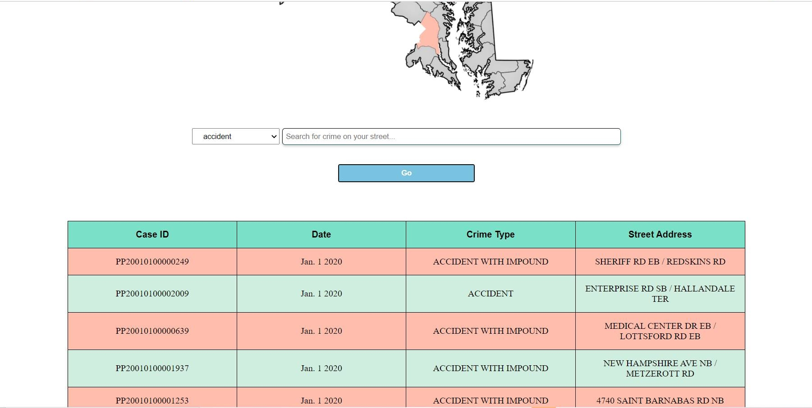
# Result when the user clicks on theft
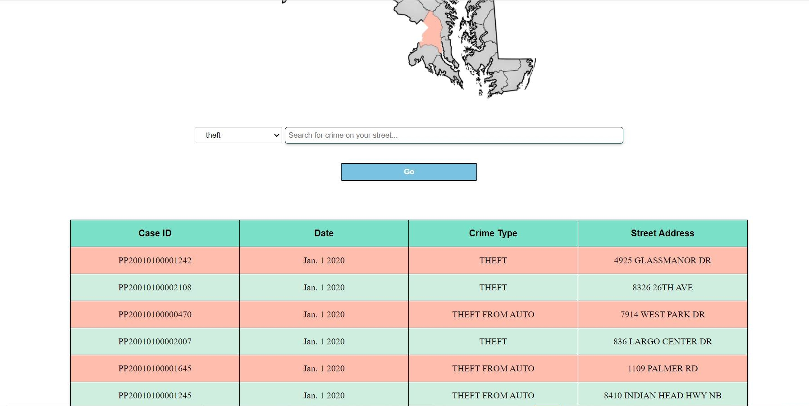
# Result when the user clicks on sex offense
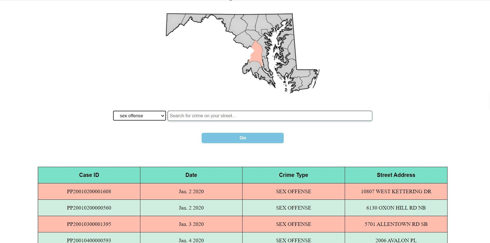
# Result when the user clicks on robbery
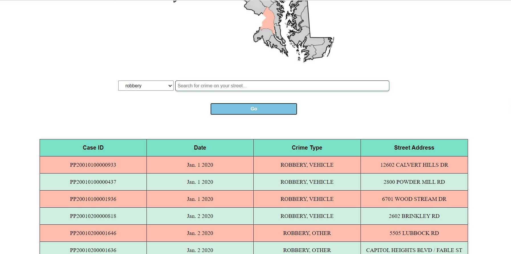
# Result when the user clicks on assault
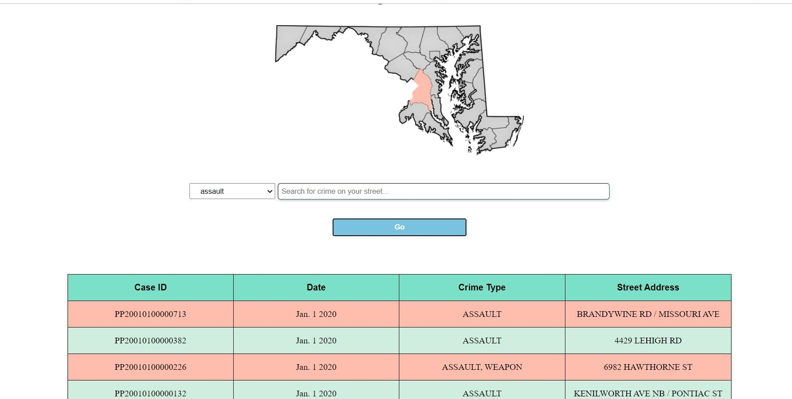
# Result when the user clicks on a specific filter and searches a specific street
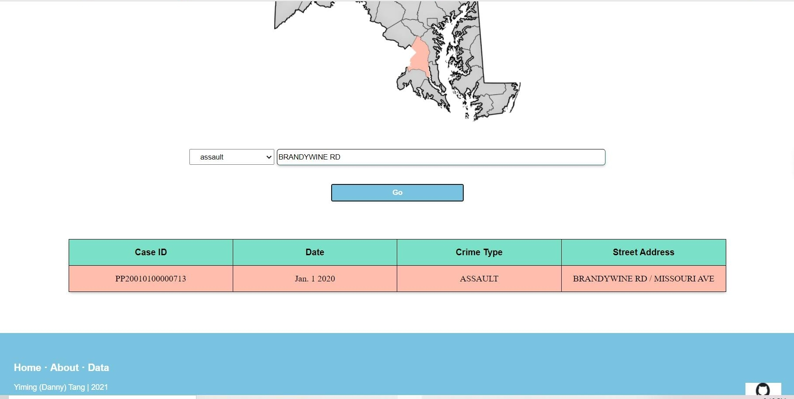
# Result when the user is on the About Page
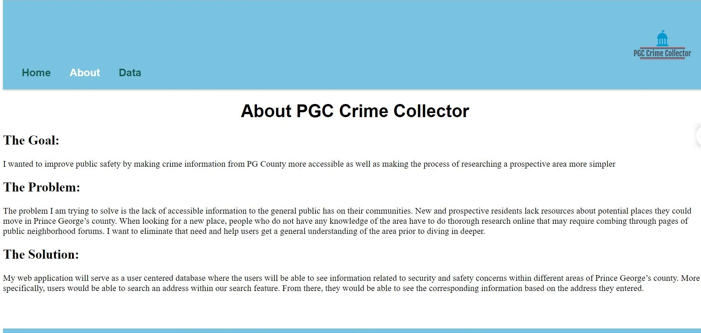
# Result when the user is on the Data Page
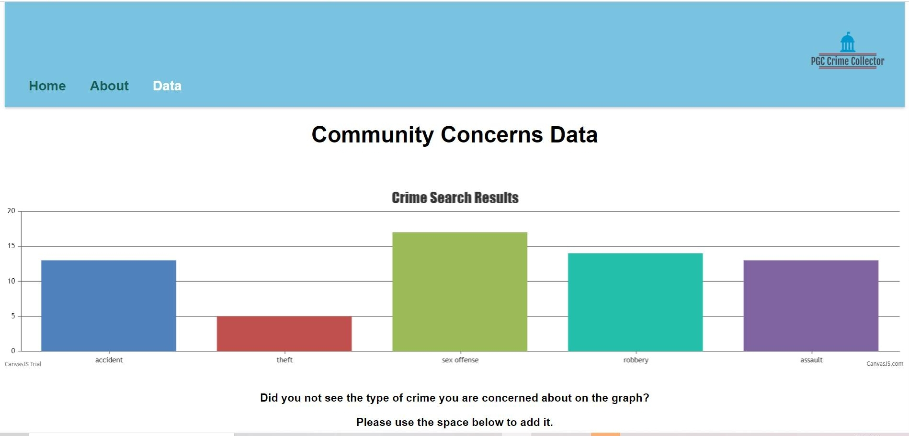
# Result when the user adds another crime in the Data Page
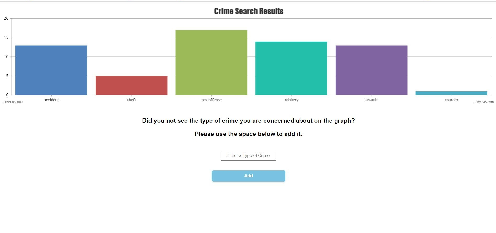
